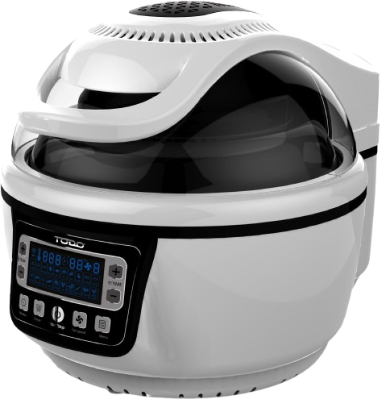

# Todo AirFryer — Home Assistant integration

  

Local LAN control for the **Todo / E Smart / SmartLive T-AF05W** air fryer
(`com.hsmartlink.SmartLive`). No cloud account, no Tuya, no MQTT bridge —
the integration talks the proprietary UDP protocol directly to the fryer
on your LAN.

> [!WARNING]
> **Safety notice — read before installing.**
> This integration can start a heating appliance. By installing it you
> acknowledge:
> - You will not use it to start cooking when nobody is home.
> - You accept all responsibility for fire, property damage, or injury.
> - The maintainers provide this software **as-is, without warranty of any
>   kind**. See `LICENSE` (Apache-2.0) for the full disclaimer.
> The protocol is reverse-engineered; a vendor firmware update could break
> it without notice.

## Features

- **Local-only** — no cloud, no internet egress required after install
- **Auto-discovery** — newly-connected fryers trigger an HA discovery
  notification via DHCP MAC/hostname match
- Exposes the fryer as a native HA device with these entities:
  - `sensor.state` — `standby` / `cooking` / `done`
  - `sensor.remaining_minutes` — coarse remaining-time bucket
  - `number.temperature` — 30 °C to 250 °C slider
  - `number.cook_time` — 1 to 60 minute slider
  - `select.fan` — fan speed 1 / 2 / 3
  - `button.start` / `button.stop`
- Status polling every 15 s
- Works as a normal HA device for scenes, scripts, and Alexa exposure via
  Nabu Casa

## Install via HACS

1. In HA, open **HACS → Integrations → ⋮ → Custom repositories**.
2. URL: `https://github.com/Penfold567/homeassistant-todo-airfryer`,
   category **Integration**.
3. Click **Install**, then restart Home Assistant.
4. Go to **Settings → Devices & Services → Add Integration**, search for
   **Todo AirFryer**, and follow the config flow.

## Manual install

1. Download the latest release from [Releases](https://github.com/Penfold567/homeassistant-todo-airfryer/releases).
2. Unzip into `config/custom_components/todo_airfryer/` on your Home
   Assistant host.
3. Restart Home Assistant.
4. **Settings → Devices & Services → Add Integration → Todo AirFryer**.

## Config flow

The integration asks for:

| Field | Meaning | Default |
| --- | --- | --- |
| Air fryer IP address | LAN IP of the fryer (assign a static lease) | auto-filled if discovered |
| Device password | Inner appliance password | `fryme` |

The HA host IP and local UDP port are detected automatically — there is
nothing else to enter. If the connect probe fails, double-check that the
fryer is online and on the same LAN (some routers isolate IoT VLANs).

## Building scenes and Alexa routines

Once entities exist you can save HA scenes for your favourite recipes —
for example a `Dino Nuggies` scene capturing
`number.temperature = 180`, `number.cook_time = 15`, `select.fan = 1`,
and then a one-line script that calls `scene.turn_on` followed by
`button.press: button.start`. Expose the script to Alexa via Nabu Casa
and you get *"Alexa, cook some dino nuggies"*.

## Protocol details

The fryer speaks a proprietary UDP protocol over port 7066, with two
layers:

1. **SDK transport** — AES-128-ECB header + custom stream cipher, with one
   of two CS2N-family checksums.
2. **Inner appliance frames** — `5a41xx` envelope where `xx` selects
   login (`01`), control (`06`), status get (`0d`), or status response
   (`08`).

See `custom_components/todo_airfryer/pysmartlive/` for the implementation.

## Limitations / known issues

- Temperature, time, and fan have **no readback** — the device does not
  expose the user-set values in status frames, so the HA sliders show the
  value you last sent, not what the fryer actually has dialled in.
- Status polling adds ~3 s of UDP chatter every 15 s while the fryer is
  reachable. Reduce poll frequency if you want quieter LAN.
- Pre-heat phase, food doneness, and basket-in-place are not exposed by
  the fryer firmware and therefore not available to HA.

## License

Apache-2.0. See `LICENSE`. This includes the standard "AS IS" warranty
disclaimer and limitation of liability — please read it.

## Support the project

If this saved you a weekend of reverse engineering, a coffee is welcome:
[buymeacoffee.com/penfold567](https://www.buymeacoffee.com/penfold567).
